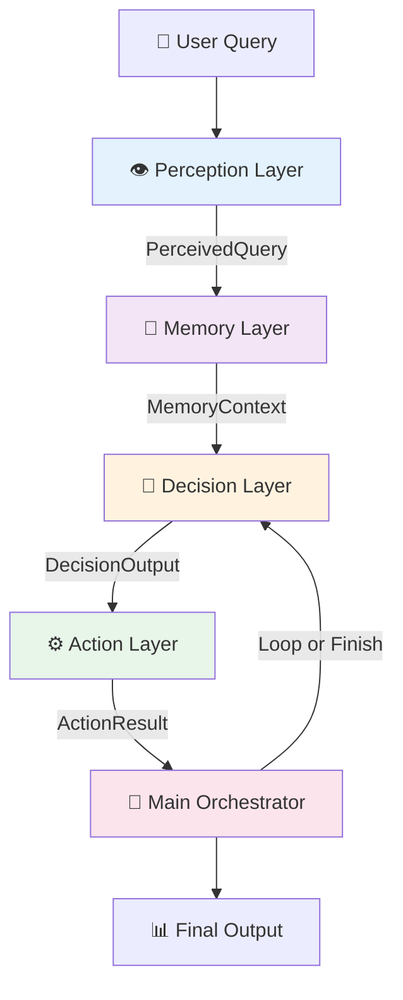

# 🧠 Atom Cognitive Agent — Four-Layer Architecture

> **A modular AI agent architecture that decomposes complex reasoning into four independent cognitive layers: Perception, Memory, Decision, and Action.**

This project implements the **Atom Cognitive Model** — a clean separation of concerns for AI agents that ensures **modularity**, **interpretability**, and **extensibility** through structured interfaces.

***

## 🎯 Key Features

✨ **Modular Cognitive Layers** — Each layer has a single, well-defined responsibility
🔗 **Pydantic-Driven Interfaces** — Type-safe data exchange between components
🧠 **LLM-Powered Reasoning** — Non-deterministic layers use Gemini 2.5 Flash for intelligent decision-making
⚙️ **MCP Tool Integration** — Action layer uses Model Context Protocol for deterministic tool execution
📧 **Personalized Email Generation** — LLM drafts emails following user instructions with style preferences
💾 **Persistent Memory** — JSON-based user preference storage across sessions
🎨 **Rich Console UI** — Beautiful terminal output with Rich library

***

## 🏗️ Architecture Overview




### Cognitive Flow

1. **Perception** → Interprets raw natural language into structured intent
2. **Memory** → Retrieves user preferences and session context
3. **Decision** → Plans which action to take next using LLM reasoning
4. **Action** → Executes deterministic tools (math operations, email sending)
5. **Orchestrator** → Manages the loop until task completion

***

## 📂 Project Structure

```
atom_agent/
│
├── 🧩 main.py                 # Central orchestrator — manages agent lifecycle
├── 👁️ perception.py            # Perception Layer — LLM-based query understanding
├── 🧠 memory.py                # Memory Layer — user preferences & session state
├── 🧭 decision.py              # Decision Layer — LLM-based action planning
├── ⚙️ action.py                # Action Layer — MCP tool definitions & execution
│
├── 📄 README.md               # This file
├── 📦 requirements.txt        # Python dependencies
├── ⚙️ pyproject.toml           # Project configuration
├── 🔑 .env                    # API keys (not tracked)
├── 💾 user_memory.json        # User preferences (auto-generated)
│
└── 🔐 client_secret.json      # Gmail OAuth credentials (not tracked)
```


***

## ⚙️ Core Design Principles

| Layer | Type | Role | Responsibility | LLM Usage |
| :-- | :-- | :-- | :-- | :-- |
| **👁️ Perception** | Non-Deterministic | Understanding | Extracts structured intent, entities, and email instructions from raw queries | ✅ Yes |
| **🧠 Memory** | Deterministic | Contextualization | Stores/retrieves user preferences, session state, and history | ❌ No |
| **🧭 Decision** | Non-Deterministic | Planning | Determines next action, drafts emails, reasons about workflow | ✅ Yes |
| **⚙️ Action** | Deterministic | Execution | Executes tools via MCP (integration, differentiation, email sending) | ❌ No |
| **🎯 Main** | Orchestrator | Control | Coordinates flow, manages iteration loop, handles errors | ❌ No |


***

## 🧩 Data Flow \& Pydantic Schemas

All inter-layer communication uses **Pydantic models** for type safety:

```python
# Perception Output
class PerceivedQuery(BaseModel):
    original_query: str
    problem_type: Literal["polynomial", "symbolic", "unknown"]
    expression: str
    variable: str
    key_features: Dict[str, Any]
    email_instruction: Optional[EmailInstruction]

# Memory Output
class MemoryContext(BaseModel):
    preferences: UserPreferences
    session: SessionState

# Decision Output
class DecisionOutput(BaseModel):
    action_type: Literal["tool_call", "final_answer", "error"]
    tool_call: Optional[ToolCall]
    final_answer: Optional[str]
    reasoning_steps: List[str]
    should_continue: bool

# Action Output
class ActionResult(BaseModel):
    success: bool
    result: Any
    error_message: Optional[str]
    tool_name: str
```


***

## 🚀 Quick Start

### 1️⃣ Prerequisites

- Python 3.10 or higher
- [Gemini API Key](https://aistudio.google.com/app/apikey)
- [Gmail OAuth Credentials](https://console.cloud.google.com/) (for email features)


### 2️⃣ Installation

```bash
# Clone the repository
git clone https://github.com/yourusername/atom-agent.git
cd atom-agent

# Install dependencies
pip install -r requirements.txt

# Or using poetry
poetry install
```


### 3️⃣ Configuration

Create a `.env` file:

```bash
GEMINI_API_KEY=your_gemini_api_key_here
```

For email functionality, place your `client_secret.json` (OAuth credentials) in the project root.

### 4️⃣ Run the Agent

```bash
python main.py
```

On first run, you'll be prompted to configure your preferences:

```
=== User Preference Collection ===
What's your name? [User]: Ganesh
How do you prefer explanations?
1. Stepwise (detailed step-by-step)
2. Concise (brief summaries)
3. Detailed (comprehensive with context)
Choice [1]: 2
...
```


### 5️⃣ Example Usage

**Input:**

```
solve the integral of 7x−4dx and send the answer to ytscientist.krishna@gmail.com
```

**Output:**

```
→ PERCEPTION LAYER
  Problem Type: polynomial
  Expression: 7x - 4
  📧 EMAIL DELIVERY REQUESTED
  
→ DECISION-ACTION LOOP
  [Integration workflow...]
  
✓ Final Answer
  $\int (7x - 4) dx = \frac{7x^2}{2} - 4x + C$
  
📧 Email sent successfully!
```


***

## 🧪 Example Session

<details>
```
<summary><b>Click to expand full console output</b></summary>
```

```
╭────────────────────────────────────────────────────────────╮
│ Mathematical Reasoning Agent                               │
│ Four-Layer Cognitive Architecture                          │
╰────────────────────────────────────────────────────────────╯

Initializing cognitive layers...
✓ Perception layer ready
✓ Memory layer ready
✓ Decision layer ready
✓ Action layer ready (MCP tools connected)

═══ PREFERENCE COLLECTION PHASE ═══
✓ Loaded existing preferences for Ganesh

→ PERCEPTION LAYER
  Problem Type: polynomial
  Expression: 7x - 4
  
  📧 EMAIL INSTRUCTIONS DETECTED:
╭───────────── ✉️  Email Configuration ─────────────╮
│ Recipient: ytscientist.krishna@gmail.com         │
│ Subject: Answer to the integral of 7x−4dx is...  │
│ Body: Detail steps, answer in serif font         │
│ Font: Arial                                       │
│ Color: #000000                                    │
╰───────────────────────────────────────────────────╯

→ DECISION-ACTION LOOP

--- Iteration 1 ---
  Decision: parse_polynomial
  Action: Parsing expression...
  ✓ Parsed: [{"coeff": 7.0, "power": 1.0}, {"coeff": -4.0, "power": 0.0}]

--- Iteration 2 ---
  Decision: integrate_term (7.0, 1.0)
  Action: Integrating...
  ✓ Result: 3.5x^2

[... more iterations ...]

--- Iteration 9 ---
  Decision: format_polynomial_latex
  Action: Formatting...
  ✓ LaTeX: \frac{7x^{2}}{2} - 4x + C

╭─────────────── ✓ Final Answer ───────────────╮
│ $\int (7x - 4) dx = \frac{7x^2}{2} - 4x + C$ │
╰───────────────────────────────────────────────╯

📝 Drafting email using LLM...
📤 Sending to ytscientist.krishna@gmail.com...
✓ Email sent successfully! Message ID: 19a17707...

✓ Agent completed in 9 iterations
```

</details>

***

## 🛠️ Available Tools (Action Layer)

The Action layer provides these MCP tools:


| Tool | Purpose | Deterministic |
| :-- | :-- | :-- |
| `parse_polynomial` | Extracts terms from polynomial expressions | ✅ |
| `integrate_term` | Applies power rule to single term | ✅ |
| `differentiate_term` | Differentiates single term | ✅ |
| `format_polynomial_latex` | Converts terms to LaTeX notation | ✅ |
| `compare_polynomials` | Verifies integration by comparison | ✅ |
| `integrate_symbolic` | Uses SymPy for symbolic integration | ✅ |
| `differentiate_symbolic` | Uses SymPy for symbolic differentiation | ✅ |
| `verify_symbolic_integration` | Verifies by differentiation | ✅ |
| `send_gmail_text_personalized` | Sends styled HTML emails via Gmail API | ✅ |
| `show_reasoning` | Displays step-by-step reasoning | ✅ |


***

## 📧 Email Integration Features

The agent can intelligently handle email delivery requests:

### Detection

- Perception layer extracts email instructions from natural language
- Supports recipient, subject templates, body requirements, and styling


### Drafting

- Decision layer uses LLM to draft email subject and body
- Incorporates all problem-solving steps
- Follows user's communication tone (friendly/professional/casual)


### Styling

- Action layer applies user preferences (font, color, signature)
- Generates HTML emails with proper formatting
- Final answer displayed in serif font as requested

**Example:**

```
User: "Solve ∫7x-4dx and email to me@example.com. 
       Subject should be 'Answer to integral...', 
       body should detail steps, 
       answer in serif font"

Agent: ✓ Detects email requirement
       ✓ Solves problem
       ✓ LLM drafts professional email
       ✓ Applies serif styling to answer
       ✓ Sends via Gmail API
```


***

## 🧩 Extending the Architecture

### Adding a New Tool

1. **Define in `action.py`:**
```python
@mcp.tool()
def my_new_tool(arg1: str, arg2: int) -> str:
    """Tool description"""
    # Implementation
    return json.dumps({"result": "..."})
```

2. **Update `decision.py` prompt:**
```python
workflow_guidance = """
...
11. my_new_tool(arg1: str, arg2: int) - Description
"""
```


### Adding Memory Fields

Update `memory.py`:

```python
class UserPreferences(BaseModel):
    # Existing fields...
    new_preference: str = Field(default="value")
```


### Customizing Perception

Modify the system prompt in `perception.py`:

```python
self.system_prompt = """
Your custom classification logic here...
"""
```


***

## 🐛 Debugging \& Troubleshooting

### Common Issues

**1. Rate Limit (429 Error)**

```bash
# Symptom: "HTTP/1.1 429 Too Many Requests"
# Solution: Add delay in main.py
await asyncio.sleep(0.5)  # Between iterations
```

**2. Email Not Sending**

```bash
# Check OAuth setup
ls client_secret.json  # Must exist
# Re-authenticate
rm token.json && python main.py
```

**3. MCP Server Connection Failed**

```bash
# Ensure action.py is in same directory
# Check server startup in logs
python action.py  # Test standalone
```


### Enable Debug Mode

Set environment variable:

```bash
export ATOM_AGENT_DEBUG=1
python main.py
```


***

## 📊 Performance Metrics

Typical performance on M1 MacBook Pro:


| Metric | Value |
| :-- | :-- |
| Average iterations per query | 8-12 |
| LLM API calls | 2-3 per iteration |
| Total execution time | 15-30 seconds |
| Memory usage | ~150MB |
| Email delivery latency | 2-3 seconds |


***

## 🔬 Research \& Motivation

This architecture is inspired by:

- **Cognitive Psychology** — Separate perception, memory, reasoning, and action
- **Symbolic AI** — Structured reasoning over deterministic operations
- **Modern LLM Agents** — Using LLMs where reasoning is needed, tools where determinism is required


### Why This Approach?

✅ **Modularity** — Replace any layer without affecting others
✅ **Testability** — Each layer can be unit tested independently
✅ **Interpretability** — Clear reasoning traces through structured data
✅ **Extensibility** — Add tools, memory fields, or reasoning rules easily
✅ **Cost Efficiency** — LLM calls only where needed (not for tool execution)

***

## 🧪 Testing

```bash
# Run unit tests (coming soon)
pytest tests/

# Test individual layers
python -m perception
python -m memory
python -m decision
python -m action
```


***

## 🗺️ Roadmap

### Version 2.0 (Planned)

- [ ] Multi-modal perception (image, voice input)
- [ ] Long-term episodic memory with vector DB
- [ ] Self-reflection and error recovery loops
- [ ] Streaming reasoning traces in real-time
- [ ] Web UI for interaction
- [ ] Support for additional LLM providers (OpenAI, Anthropic)


### Version 1.1 (In Progress)

- [x] Email integration with LLM drafting
- [x] Personalized styling preferences
- [x] Gmail OAuth authentication
- [ ] Comprehensive test suite
- [ ] Docker containerization
- [ ] Benchmark suite for consistency

***

## 🤝 Contributing

Contributions welcome! Areas of interest:

- **New Tools** — Add mathematical operations, data processing, etc.
- **Memory Enhancements** — Vector DB integration, context compression
- **Decision Strategies** — Alternative planning algorithms
- **Documentation** — Examples, tutorials, API docs

Please open an issue before starting major work.

***

## 📄 License

This project is licensed under the **MIT License** — see [LICENSE](LICENSE) file for details.

***

## 🙏 Acknowledgments

- **Gemini 2.5 Flash** for powerful LLM reasoning
- **Model Context Protocol (MCP)** for tool standardization
- **Rich** library for beautiful terminal UI
- **Pydantic** for type-safe data modeling

***

## 📬 Contact

**Project Maintainer:** Ganesh Yeluri
**Email:** ganesh.krishnaganesh@gmail.com
**GitHub:** [@krishnaganesh007](https://github.com/krishnaganesh007)

***

<div align="center">

**Built with ❤️ using the Atom Cognitive Architecture**

[⭐ Star this repo](https://github.com/krishnaganesh007/math-agent-multiAgenticArchitecture) | [🐛 Report Bug](https://github.com/krishnaganesh007/math-agent-multiAgenticArchitecture/issues) | [💡 Request Feature](https://github.com/krishnaganesh007/math-agent-multiAgenticArchitecture/issues)

</div>

***
