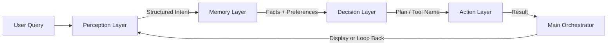

# 🧠 Atom Cognitive Agent — Modular Architecture

This repository implements an **Atom Cognitive Model**, which decomposes a monolithic AI agent into **four independent cognitive layers** — **Perception**, **Memory**, **Decision**, and **Action** — orchestrated by a central **main.py** file.

The architecture ensures **modularity**, **structured reasoning**, and **clear cognitive separation**, using **Pydantic schemas** for consistent data exchange between components.

---

## 📂 Project Structure

```
atom_agent/
│
├── main.py          # 🧩 Orchestrator – controls agent flow
├── perception.py    # 👁️ Perceive Layer – interprets raw queries using LLM
├── memory.py        # 🧠 Memory Layer – stores and retrieves user preferences
├── decision.py      # 🧭 Decision Layer – plans and decides next actions
├── action.py        # ⚙️ Action Layer – executes deterministic tool operations
├── README.md        # Project documentation
├── requirements.txt # Python dependencies
├── pyproject.toml   # Dependency management
└── user_memory.json # Ignored: stores user session preferences
```

---

## ⚙️ Core Design Principles

| Layer          | Cognition Type    | Role              | Responsibility                                                                           |
| -------------- | ----------------- | ----------------- | ---------------------------------------------------------------------------------------- |
| **Perception** | Non-Deterministic | Understanding     | Converts user’s natural query into structured data (intent + facts)                      |
| **Memory**     | Deterministic     | Contextualization | Stores and recalls user preferences and relevant state                                   |
| **Decision**   | Non-Deterministic | Planning          | Determines which tool/action should be invoked next                                      |
| **Action**     | Deterministic     | Execution         | Runs the actual operation (e.g., integration, summarization, formatting, sending emails) |
| **Main**       | Orchestrator      | Control           | Coordinates flow between layers in sequence or loops                                     |

---

## 🧩 Cognitive Flow Overview



### Step-by-Step Execution

1. **Perception Layer (`perception.py`)**

   * Accepts the raw user query.
   * Uses an internal **prompt** to extract key details (intent, entities, variables).
   * Outputs a `PerceivedQuery` Pydantic object with structured data.

2. **Memory Layer (`memory.py`)**

   * Stores user state and preferences (e.g., font, display mode, location).
   * Retrieves and merges this data with the perceived query before passing it onward.

3. **Decision Layer (`decision.py`)**

   * Combines perceived facts and memory context.
   * Determines which **Action** to execute next.
   * Returns a `DecisionPlan` Pydantic object containing the next step and rationale.

4. **Action Layer (`action.py`)**

   * Executes deterministic tools (integration, differentiation, formatting, email sending, etc.).
   * Returns structured `ActionResult` objects containing operation outcomes.

5. **Main Orchestrator (`main.py`)**

   * Coordinates all four modules.
   * Demonstrates end-to-end flow.
   * Can optionally loop through Decision and Action layers if multiple tool calls are required.

---

## 🧩 Pydantic Schemas

| Schema           | Defined In      | Purpose                                              |
| ---------------- | --------------- | ---------------------------------------------------- |
| `PerceivedQuery` | `perception.py` | Represents structured perception output              |
| `MemoryContext`  | `memory.py`     | Stores user state, preferences, and retrieved memory |
| `DecisionPlan`   | `decision.py`   | Contains chosen action and planning rationale        |
| `ActionResult`   | `action.py`     | Represents tool execution result                     |

---

## 🧪 Running the Agent

### 1️⃣ Install dependencies

```bash
pip install -r requirements.txt
```

### 2️⃣ Set up environment

If using LLM-based reasoning (e.g., Gemini or OpenAI):

```bash
export GEMINI_API_KEY="your_api_key"
```

### 3️⃣ Run the orchestrator

```bash
python main.py
```

### 4️⃣ Expected Output (Console)

```
USER: ∫4x^6 - 2x^3 + 7x - 4 dx
[PERCEPTION] → Classified as POLYNOMIAL
[MEMORY] → Retrieved preferences: display_mode = LaTeX
[DECISION] → Selected Action: integrate
[ACTION] → Integration completed successfully
[FINAL OUTPUT] → (4/7)x^7 - (1/2)x^4 + (7/2)x^2 - 4x + C
```

> **Example :** 
- User query: "solve the integral of  7x−4dx and send the answer to ytscientist.krishna@gmail.com"
- Output:
```
╭────────────────────────────────────────────────────────────────────────────────────────────────────────────────────────────────────────╮
│ Mathematical Reasoning Agent                                                                                                           │
│ Four-Layer Cognitive Architecture                                                                                                      │
╰────────────────────────────────────────────────────────────────────────────────────────────────────────────────────────────────────────╯

Initializing cognitive layers...
✓ Perception layer ready
✓ Memory layer ready
✓ Decision layer ready

═══ PREFERENCE COLLECTION PHASE ═══
✓ Loaded existing preferences for Ganesh
╭─────────────────────────────────────────────────────────── User Preferences ───────────────────────────────────────────────────────────╮
│ Name: Ganesh                                                                                                                           │
│ Explanation Style: concise                                                                                                             │
│ Method: symbolic                                                                                                                       │
│ Math Level: intermediate                                                                                                               │
│ Show Reasoning: True                                                                                                                   │
╰────────────────────────────────────────────────────────────────────────────────────────────────────────────────────────────────────────╯
✓ Action layer ready (MCP tools connected)

═══ AGENTIC FLOW STARTS ═══

Enter integration problem (or press Enter for default): solve the integral of  7x−4dx and send the answer to ytscientist.krishna@gmail.com 
╭─────────────────────────────────────────────────────────────── Problem ────────────────────────────────────────────────────────────────╮
│ solve the integral of  7x−4dx and send the answer to ytscientist.krishna@gmail.com                                                     │
╰────────────────────────────────────────────────────────────────────────────────────────────────────────────────────────────────────────╯

→ PERCEPTION LAYER
[10/24/25 23:46:13] INFO     AFC is enabled with max remote calls: 10.                                                      models.py:4998
[10/24/25 23:46:20] INFO     HTTP Request: POST                                                                            _client.py:1025
                             https://generativelanguage.googleapis.com/v1beta/models/gemini-2.5-flash:generateContent                     
                             "HTTP/1.1 200 OK"                                                                                            
  Problem Type: polynomial
  Expression: 7x - 4
  Features: {'has_trig': False, 'has_exp': False, 'has_log': False, 'has_polynomials': True, 'max_power': 1}
  Will send final answer to ytscientist.krishna@gmail.com

→ MEMORY LAYER
  Loaded preferences for Ganesh

→ DECISION-ACTION LOOP

--- Iteration 1 ---
  Decision Layer: Planning next action...
                    INFO     AFC is enabled with max remote calls: 10.                                                      models.py:4998
[10/24/25 23:46:23] INFO     HTTP Request: POST                                                                            _client.py:1025
                             https://generativelanguage.googleapis.com/v1beta/models/gemini-2.5-flash:generateContent                     
                             "HTTP/1.1 200 OK"                                                                                            
    The user, Ganesh, has requested integration of the polynomial expression '7x - 4'.
    User preferences indicate a 'symbolic' preferred method.
    The 'integrate_symbolic' tool is suitable for this task as it handles symbolic integration of expressions.
  Action Layer: Executing integrate_symbolic
    Reason: Ganesh prefers the symbolic method for integration, and the problem is a polynomial. Therefore, using 'integrate_symbolic' is 
the most direct approach to find the antiderivative of '7x - 4' with respect to 'x'.
[10/24/25 23:46:23] INFO     Processing request of type CallToolRequest                                                      server.py:674
FUNCTION CALL: integrate_symbolic(7x - 4, x)
                    INFO     Processing request of type ListToolsRequest                                                     server.py:674
    ✓ Success

--- Iteration 2 ---
  Decision Layer: Planning next action...
                    INFO     AFC is enabled with max remote calls: 10.                                                      models.py:4998
[10/24/25 23:46:34] INFO     HTTP Request: POST                                                                            _client.py:1025
                             https://generativelanguage.googleapis.com/v1beta/models/gemini-2.5-flash:generateContent                     
                             "HTTP/1.1 200 OK"                                                                                            
    The user's preferred method is 'symbolic'.
    The `integrate_symbolic` tool failed with a 'No module named 'sympy'' error, indicating it cannot be used.
    The problem involves a polynomial expression that can be integrated using polynomial-specific tools (`parse_polynomial`, 
`integrate_term`).
    Given the 'professional' communication tone and other personalization preferences, it is best to inform the user about the technical 
issue and propose an alternative method before proceeding.
    The `send_gmail_text_personalized` tool is appropriate for this communication.
  Action Layer: Executing send_gmail_text_personalized
    Reason: The user preferred a symbolic method, but the `integrate_symbolic` tool failed due to a missing 'sympy' module. To maintain 
professionalism and inform the user about the issue while offering an alternative, I need to send an email. This email will explain the 
problem and propose using the polynomial method, adhering to the user's communication tone, font style, font color, and signature 
preferences.
[10/24/25 23:46:34] INFO     Processing request of type CallToolRequest                                                      server.py:674
                    INFO     file_cache is only supported with oauth2client<4.0.0                                           __init__.py:49
    ✓ Success

--- Iteration 3 ---
  Decision Layer: Planning next action...
[10/24/25 23:46:36] INFO     AFC is enabled with max remote calls: 10.                                                      models.py:4998
[10/24/25 23:46:40] INFO     HTTP Request: POST                                                                            _client.py:1025
                             https://generativelanguage.googleapis.com/v1beta/models/gemini-2.5-flash:generateContent                     
                             "HTTP/1.1 200 OK"                                                                                            
    The user wants to integrate the expression '7x - 4'.
    User preferences specify a 'symbolic' method and 'intermediate' math level.
    The `integrate_symbolic` tool is suitable for this task.
  Action Layer: Executing integrate_symbolic
    Reason: The user's preferred method is symbolic and the perceived problem type is a polynomial, so using 'integrate_symbolic' is the 
most direct approach to find the antiderivative of '7x - 4'.
[10/24/25 23:46:40] INFO     Processing request of type CallToolRequest                                                      server.py:674
FUNCTION CALL: integrate_symbolic(7x - 4, x)
    ✓ Success

--- Iteration 4 ---
  Decision Layer: Planning next action...
                    INFO     AFC is enabled with max remote calls: 10.                                                      models.py:4998
[10/24/25 23:46:46] INFO     HTTP Request: POST                                                                            _client.py:1025
                             https://generativelanguage.googleapis.com/v1beta/models/gemini-2.5-flash:generateContent                     
                             "HTTP/1.1 200 OK"                                                                                            
    The previous attempt to use the symbolic integration tool failed due to a missing module.
    Since the problem is a polynomial, and symbolic integration is not currently working, I will fall back to the polynomial workflow 
using term-by-term integration.
    The initial step for term-by-term integration is to parse the given polynomial expression.
  Action Layer: Executing parse_polynomial
    Reason: The preferred symbolic integration method failed. As a fallback, I will proceed with the polynomial workflow. The first step 
in this workflow is to parse the polynomial expression into its individual terms to prepare for term-by-term integration.
[10/24/25 23:46:46] INFO     Processing request of type CallToolRequest                                                      server.py:674
FUNCTION CALL: parse_polynomial()
Input: 7x - 4
Parsed: [{"coeff": 7.0, "power": 1.0}, {"coeff": -4.0, "power": 0.0}]
    ✓ Success

--- Iteration 5 ---
  Decision Layer: Planning next action...
                    INFO     AFC is enabled with max remote calls: 10.                                                      models.py:4998
[10/24/25 23:46:50] INFO     HTTP Request: POST                                                                            _client.py:1025
                             https://generativelanguage.googleapis.com/v1beta/models/gemini-2.5-flash:generateContent                     
                             "HTTP/1.1 200 OK"                                                                                            
    The problem is to find the integral of the polynomial expression '7x - 4'.
    User preferences specify 'symbolic' as the preferred method.
    The 'integrate_symbolic' tool is designed for this purpose, taking the expression and variable as input.
  Action Layer: Executing integrate_symbolic
    Reason: The user's preferred method is 'symbolic' and the problem involves a polynomial expression. Therefore, the 
'integrate_symbolic' tool is the most suitable choice for finding the antiderivative of the given expression.
[10/24/25 23:46:50] INFO     Processing request of type CallToolRequest                                                      server.py:674
FUNCTION CALL: integrate_symbolic(7x - 4, x)
    ✓ Success

--- Iteration 6 ---
  Decision Layer: Planning next action...
                    INFO     AFC is enabled with max remote calls: 10.                                                      models.py:4998
[10/24/25 23:46:55] INFO     HTTP Request: POST                                                                            _client.py:1025
                             https://generativelanguage.googleapis.com/v1beta/models/gemini-2.5-flash:generateContent                     
                             "HTTP/1.1 200 OK"                                                                                            
    The `integrate_symbolic` tool failed due to a missing 'sympy' module.
    Given that the problem is a polynomial and symbolic integration is currently unavailable, I will switch to the polynomial workflow and
integrate term by term.
    The expression '7x - 4' has been parsed into two terms: {'coeff': 7.0, 'power': 1.0} and {'coeff': -4.0, 'power': 0.0}.
    I will integrate the first term: coeff=7.0, power=1.0 using the `integrate_term` tool.
  Action Layer: Executing integrate_term
    Reason: The user's preferred method is symbolic, but the `integrate_symbolic` tool failed due to a missing module. As the problem is a
polynomial, I will proceed with term-by-term integration. The first term in the parsed expression '7x - 4' is '7x', which has a 
coefficient of 7.0 and a power of 1.0. I will integrate this term using the `integrate_term` tool.
[10/24/25 23:46:55] INFO     Processing request of type CallToolRequest                                                      server.py:674
FUNCTION CALL: integrate_term(7.0, 1.0)
Result: {"status": "success", "coeff": 3.5, "power": 2.0}
    ✓ Success

--- Iteration 7 ---
  Decision Layer: Planning next action...
                    INFO     AFC is enabled with max remote calls: 10.                                                      models.py:4998
[10/24/25 23:46:59] INFO     HTTP Request: POST                                                                            _client.py:1025
                             https://generativelanguage.googleapis.com/v1beta/models/gemini-2.5-flash:generateContent                     
                             "HTTP/1.1 200 OK"                                                                                            
    Identify the remaining term to be integrated from the parsed terms and already integrated terms.
    The remaining term is -4 (or -4x^0).
    Call the 'integrate_term' tool with the coefficient -4.0 and power 0.0.
  Action Layer: Executing integrate_term
    Reason: The polynomial '7x - 4' has been parsed into two terms. One term (7x) has already been integrated. The remaining term is '-4',
which can be represented as -4x^0. I need to integrate this remaining term using the 'integrate_term' tool.
[10/24/25 23:46:59] INFO     Processing request of type CallToolRequest                                                      server.py:674
FUNCTION CALL: integrate_term(-4.0, 0.0)
Result: {"status": "success", "coeff": -4.0, "power": 1.0}
    ✓ Success

--- Iteration 8 ---
  Decision Layer: Planning next action...
                    INFO     AFC is enabled with max remote calls: 10.                                                      models.py:4998
[10/24/25 23:47:05] INFO     HTTP Request: POST                                                                            _client.py:1025
                             https://generativelanguage.googleapis.com/v1beta/models/gemini-2.5-flash:generateContent                     
                             "HTTP/1.1 200 OK"                                                                                            
    Recognized that all terms of the polynomial 7x - 4 have been successfully integrated.
    Assembled the integrated terms: 3.5x^2 and -4x.
    The next logical step is to format these integrated terms into a coherent LaTeX polynomial expression.
    This formatted expression will then be used for symbolic verification as per user preference (Verification Required: True).
  Action Layer: Executing format_polynomial_latex
    Reason: All terms of the polynomial have been integrated. Now, I need to format the integrated terms into a LaTeX expression before 
proceeding to verification and presenting the final answer.
[10/24/25 23:47:05] INFO     Processing request of type CallToolRequest                                                      server.py:674
FUNCTION CALL: format_polynomial_latex()
LaTeX: \frac{7x^{2}}{2} - 4x + C
    ✓ Success

--- Iteration 9 ---
  Decision Layer: Planning next action...
                    INFO     AFC is enabled with max remote calls: 10.                                                      models.py:4998
[10/24/25 23:47:09] INFO     HTTP Request: POST                                                                            _client.py:1025
                             https://generativelanguage.googleapis.com/v1beta/models/gemini-2.5-flash:generateContent                     
                             "HTTP/1.1 200 OK"                                                                                            
    The integration result has been formatted as LaTeX: `\frac{7x^{2}}{2} - 4x + C`.
    User preferences indicate a 'symbolic' method and 'verification required'.
    To comply with verification requirements, I will use the `verify_symbolic_integration` tool.
    The original expression is '7x - 4' and the computed antiderivative (without the constant 'C') is '7x^2/2 - 4x'.
  Action Layer: Executing verify_symbolic_integration
    Reason: The user prefers the symbolic method and requires verification. The integration has been performed and formatted. Now, I need 
to verify the antiderivative against the original expression using the symbolic verification tool before providing the final answer.
[10/24/25 23:47:10] INFO     Processing request of type CallToolRequest                                                      server.py:674
FUNCTION CALL: verify_symbolic_integration()
    ✓ Success

--- Iteration 10 ---
  Decision Layer: Planning next action...
[10/24/25 23:47:10] INFO     AFC is enabled with max remote calls: 10.                                                      models.py:4998
[10/24/25 23:47:19] INFO     HTTP Request: POST                                                                            _client.py:1025
                             https://generativelanguage.googleapis.com/v1beta/models/gemini-2.5-flash:generateContent                     
                             "HTTP/1.1 200 OK"                                                                                            
    The integration of the polynomial `7x - 4` was performed term by term. The term `7x` integrates to `3.5x^2` and the term `-4` 
integrates to `-4x`.
    During verification, the `verify_symbolic_integration` tool encountered an error due to a missing 'sympy' module. Therefore, a manual 
verification was performed.
    To verify, the antiderivative `3.5x^2 - 4x` was differentiated:
      - The derivative of `3.5x^2` is `3.5 * 2 * x^(2-1) = 7x`.
      - The derivative of `-4x` is `-4 * 1 * x^(1-1) = -4`.
    Combining these, the derivative is `7x - 4`, which matches the original expression.
    Thus, the integration is verified as correct.
╭──────────────────────────────────────────────────────────── ✓ Final Answer ────────────────────────────────────────────────────────────╮
│ $$\int (7x - 4) dx = 3.5x^2 - 4x + C$$                                                                                                 │
╰────────────────────────────────────────────────────────────────────────────────────────────────────────────────────────────────────────╯
Sending final answer to ytscientist.krishna@gmail.com...
[10/24/25 23:47:19] INFO     Processing request of type CallToolRequest                                                      server.py:674
                    INFO     file_cache is only supported with oauth2client<4.0.0                                           __init__.py:49
{
  "status": "success",
  "message": "Email sent successfully to ytscientist.krishna@gmail.com. Message ID: 19a17707fb73e07e",
  "message_id": "19a17707fb73e07e",
  "content": [
    {
      "type": "text",
      "text": "Email sent successfully to ytscientist.krishna@gmail.com. Message ID: 19a17707fb73e07e",
      "annotations": null,
      "_meta": null
    }
  ]
}

✓ Agent completed in 10 iterations
```

---

## 🧩 Modularity & Extendibility

Each cognitive layer can be extended independently:

* Add a **new tool** (e.g., plotting or simplification) → update `action.py`
* Add a **new reasoning rule** → update `decision.py`
* Add **new data extraction logic** → update `perception.py`
* Add **session memory or persistence** → extend `memory.py`

All modules remain compatible because of **Pydantic-based structured interfaces**.

---

## 🧠 Future Enhancements

* [ ] Integrate feedback loop between Decision and Memory layers
* [ ] Add streaming reasoning traces for interpretability
* [ ] Incorporate error recovery in Action layer
* [ ] Add benchmark suite for reasoning consistency

---

## 🧾 License

This project is released under the **MIT License** — feel free to modify and extend the architecture for educational or production use.
