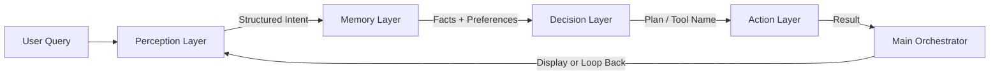

# 🧠 Atom Cognitive Agent — Modular Architecture

This repository implements an **Atom Cognitive Model**, which decomposes a monolithic AI agent into **four independent cognitive layers** — **Perception**, **Memory**, **Decision**, and **Action** — orchestrated by a central **main.py** file.  

The architecture ensures **modularity**, **structured reasoning**, and **clear cognitive separation**, using **Pydantic schemas** for consistent data exchange between components.

---

## 📂 Project Structure

```
atom_agent/
│
├── main.py          # 🧩 Orchestrator – controls agent flow
├── perception.py    # 👁️ Perceive Layer – interprets raw queries using LLM
├── memory.py        # 🧠 Memory Layer – stores and retrieves user preferences
├── decision.py      # 🧭 Decision Layer – plans and decides next actions
├── action.py        # ⚙️ Action Layer – executes deterministic tool operations
└── requirements.txt # Python dependencies
```

---

## ⚙️ Core Design Principles

| Layer | Cognition Type | Role | Responsibility |
|-------|----------------|------|----------------|
| **Perception** | Non-Deterministic | Understanding | Converts user’s natural query into structured data (intent + facts) |
| **Memory** | Deterministic | Contextualization | Stores and recalls user preferences and relevant state |
| **Decision** | Non-Deterministic | Planning | Determines which tool/action should be invoked next |
| **Action** | Deterministic | Execution | Runs the actual operation (e.g., integration, summarization) |
| **Main** | Orchestrator | Control | Coordinates flow between layers in sequence or loops |

---

## 🧩 Cognitive Flow Overview



### Step-by-Step Execution

1. **Perception Layer (`perception.py`)**  
   - Accepts the raw user query.  
   - Uses an internal **prompt** to extract key details (intent, entities, variables).  
   - Outputs a `PerceivedQuery` Pydantic object with structured data.  

2. **Memory Layer (`memory.py`)**  
   - Stores user state and preferences (e.g., "font": "serif", "location": "Bangalore").  
   - Retrieves and merges this data with the perceived query before passing it onward.  

3. **Decision Layer (`decision.py`)**  
   - Combines perceived facts and memory context.  
   - Determines which **Action** to execute next.  
   - Returns a `DecisionPlan` Pydantic object containing the next step and rationale.  

4. **Action Layer (`action.py`)**  
   - Executes deterministic tools (integration, differentiation, formatting, etc.).  
   - Returns structured `ActionResult` objects containing operation outcomes.  

5. **Main Orchestrator (`main.py`)**  
   - Coordinates all four modules.  
   - Demonstrates end-to-end flow.  
   - Can optionally loop through Decision and Action layers if multiple tool calls are required.

---

## 🧩 Pydantic Schemas

| Schema | Defined In | Purpose |
|---------|-------------|----------|
| `PerceivedQuery` | `perception.py` | Represents structured perception output |
| `MemoryContext` | `memory.py` | Stores user state, preferences, and retrieved memory |
| `DecisionPlan` | `decision.py` | Contains chosen action and planning rationale |
| `ActionResult` | `action.py` | Represents tool execution result |

---

## 🧪 Running the Agent

### 1️⃣ Install dependencies
```bash
pip install -r requirements.txt
```

### 2️⃣ Set up environment
If using LLM-based reasoning (e.g., Gemini or OpenAI):
```bash
export GEMINI_API_KEY="your_api_key"
```

### 3️⃣ Run the orchestrator
```bash
python main.py
```

### 4️⃣ Expected Output (Console)
```
[Perception Output]
PerceivedQuery(problem_type='symbolic', expression='sin(x) * exp(x)', variable='x')

[Decision Output]
DecisionPlan(action='integrate', rationale='[DECISION] Symbolic type detected...', confidence=0.95)

[Action Output]
{'status': 'success', 'operation': 'integration', 'result': 'exp(x)*(sin(x) - cos(x))/2'}
```

---

## 🧩 Modularity & Extendibility

Each cognitive layer can be extended independently:
- Add a **new tool** (e.g., plotting or simplification) → update `action.py`
- Add a **new reasoning rule** → update `decision.py`
- Add **new data extraction logic** → update `perception.py`
- Add **session memory or persistence** → extend `memory.py`

All modules remain compatible because of **Pydantic-based structured interfaces**.

---

## 🧠 Future Enhancements

- [ ] Integrate feedback loop between Decision and Memory layers  
- [ ] Add streaming reasoning traces for interpretability  
- [ ] Incorporate error recovery in Action layer  
- [ ] Add benchmark suite for reasoning consistency  

---

## 🧘 Example Cognitive Trace

```
USER: ∫4x^6 - 2x^3 + 7x - 4 dx
↓
[PERCEPTION] → Classified as POLYNOMIAL
↓
[MEMORY] → Retrieved preferences: display_mode = LaTeX
↓
[DECISION] → Selected Action: integrate
↓
[ACTION] → Integration completed successfully
↓
[FINAL OUTPUT] → (4/7)x^7 - (1/2)x^4 + (7/2)x^2 - 4x + C
```

---

## 🧾 License

This project is released under the **MIT License** — feel free to modify and extend the architecture for educational or production use.
